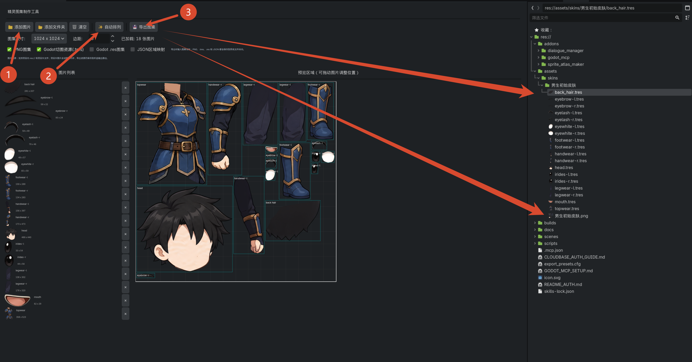

# Godot Atlas Maker

[中文文档](README.zh-CN.md)

Godot Atlas Maker is a Godot 4 editor plugin for building texture atlases from many source images. It can arrange sprites, preview atlas pages, export PNG atlas sheets, and generate Godot `AtlasTexture` resources.

## Preview



## Features

- Batch import images or image folders.
- Auto-arrange sprites with atlas padding.
- Manually adjust sprite positions in the preview canvas.
- Export PNG atlas sheets.
- Export `.tres` `AtlasTexture` resources.
- Export runtime `.res` atlas texture resources when PNG output is disabled.
- Export JSON region maps.
- Split oversized sprite sets into multiple atlas pages.
- Preview all atlas pages side by side, with mouse-wheel zoom and hover highlighting.
- Snap manually positioned sprites to atlas boundaries and neighboring sprite edges.
- Switch the editor interface between English and Chinese.

## Installation

1. Copy `addons/godot_atlas_maker` into your Godot project's `addons/` directory.
2. Open the project in Godot.
3. Go to `Project > Project Settings > Plugins`.
4. Enable `Godot Atlas Maker`.

The plugin adds an `Atlas Maker` main-screen tab in the editor.

## Development

This repository is structured as a small Godot project so plugin paths resolve from `res://addons/godot_atlas_maker`.

Run the lightweight script tests from the repository root with Godot 4:

```powershell
godot --headless --path . --script res://addons/godot_atlas_maker/tests/test_atlas_packer.gd
godot --headless --path . --script res://addons/godot_atlas_maker/tests/test_atlas_exporter.gd
godot --headless --path . --script res://addons/godot_atlas_maker/tests/test_atlas_localization.gd
godot --headless --path . --script res://addons/godot_atlas_maker/tests/test_preview_transform.gd
godot --headless --path . --script res://addons/godot_atlas_maker/tests/test_preview_snap.gd
```

## Repository Layout

```text
addons/godot_atlas_maker/
  plugin.cfg
  plugin.gd
  atlas_maker_panel.tscn
  atlas_maker_panel.gd
  atlas_packer.gd
  atlas_exporter.gd
  tests/
```

## License

MIT License. See [LICENSE](LICENSE).
