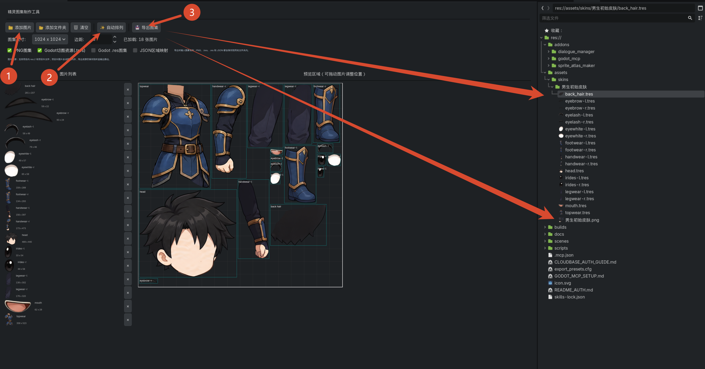

# Godot Atlas Maker

Godot Atlas Maker 是一个 Godot 4 编辑器插件，用于把多张图片制作成纹理图集。它支持批量导入图片、自动排列、预览图集、导出 PNG 图集，并生成 Godot 原生的 `AtlasTexture` 资源。

[English README](README.md)

## 界面示意图



## 功能特性

- 批量导入图片或整个图片文件夹。
- 根据图集尺寸和边距自动排列图片。
- 在预览画布中手动拖动图片位置。
- 导出 PNG 图集图片。
- 导出 `.tres` 格式的 `AtlasTexture` 资源。
- 在不导出 PNG 时，可导出运行时使用的 `.res` 图集纹理资源。
- 导出 JSON 区域映射文件，方便其他工具链读取。
- 当图片数量或尺寸超过单张图集容量时，可拆分为多页图集。

## 适用场景

- 角色部件、UI 图标、道具素材等 2D 图片的图集合并。
- 需要在 Godot 中直接使用 `AtlasTexture` 的项目。
- 希望在编辑器内完成图集制作，而不是切换到外部工具的工作流。
- 需要批量导出图集区域映射数据的项目。

## 安装方法

1. 下载或克隆本仓库。
2. 将 `addons/godot_atlas_maker` 文件夹复制到你的 Godot 项目的 `addons/` 目录中。
3. 打开 Godot 项目。
4. 进入 `项目 > 项目设置 > 插件`。
5. 找到并启用 `Godot Atlas Maker`。

启用后，Godot 编辑器顶部会出现 `Atlas Maker` 主屏幕标签。

## 使用方法

1. 打开 `Atlas Maker` 标签。
2. 点击添加图片按钮，选择多张图片；或者选择一个包含图片的文件夹。
3. 设置图集尺寸和图片边距。
4. 点击自动排列，让插件生成初始布局。
5. 如有需要，在预览画布中拖动图片微调位置。
6. 点击导出，选择输出路径和导出格式。

## 导出内容

根据你选择的导出选项，插件可以生成以下文件：

```text
output/
  atlas.png
  item_a.tres
  item_b.tres
  atlas_texture.res
  atlas_map.json
```

常见导出用途：

- `atlas.png`：合并后的图集图片。
- `.tres`：每个源图片对应的 Godot `AtlasTexture` 资源。
- `.res`：可由 `.tres` 引用的共享图集纹理资源。
- `.json`：记录每个图片在图集中的位置和尺寸。

## 图片格式

插件主要面向 Godot 可导入的常见图片格式，例如：

- PNG
- JPG / JPEG
- WebP
- BMP

实际可用格式取决于当前 Godot 版本的图片导入支持。

## 开发与测试

本仓库本身是一个最小 Godot 项目，插件路径固定为：

```text
res://addons/godot_atlas_maker
```

如果你的 Godot 可执行文件已经加入 PATH，可以在仓库根目录运行测试：

```powershell
godot --headless --path . --script res://addons/godot_atlas_maker/tests/test_atlas_packer.gd
godot --headless --path . --script res://addons/godot_atlas_maker/tests/test_atlas_exporter.gd
```

## 目录结构

```text
addons/godot_atlas_maker/
  plugin.cfg
  plugin.gd
  atlas_maker_panel.tscn
  atlas_maker_panel.gd
  atlas_packer.gd
  atlas_exporter.gd
  tests/
```

## 贡献

欢迎提交 Issue 或 Pull Request。比较适合优先改进的方向包括：

- 更紧凑的装箱算法。
- 更多导出格式。
- 更好的多页图集管理。
- 更完整的编辑器界面本地化。
- 示例工程和截图。

## 许可证

本项目使用 MIT License。详情见 [LICENSE](LICENSE)。
